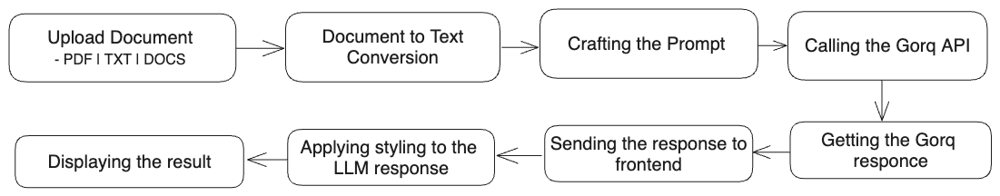
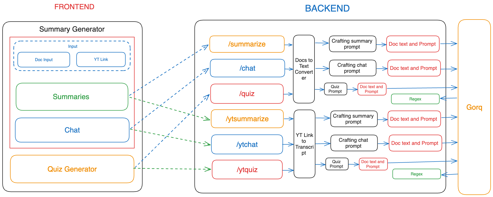

## Internal Working of the Summarizer Application 

In this project we are working on the two main features of the application. The first one is the summary generation and the second one is the quiz generation. 

### Summary Generation

The summary generation feature is implemented using the Gorq. The Gorq SDK is a powerful tool that allows you to interact with the open source LLM models like Llama 3.

User have to upload a supported Documents like pdf, txt and docs file and also the youtube video link and the application will generate a summary of the Documents.

We first extract the text from the PDF file using the PyPDF2 library. Then we develop the prompt and the instruction from the user and then we pass the text to the Gorq SDK. If the give prompt along with the text extracted form documents are in limit of context window of the model then the model will generate the summary.

and then the generated summary is displayed on the page.

### Chat with Document

The chat with document feature is implemented using similar way as the summary generation. once the user generated the summary the user can chat with the document. below the summery it the input field where the user can enter the question and the answer will be displayed on the page.

### Quiz Generation

The quiz generation feature is where user give document and the application will generate a quiz based on the document and also user can provide Youtube video link and the application will generate the quiz based on the video.

### FlowChart

In above flowchart we can see the flow of the application.

### Diagram

In above diagram we can see the flow of the application. the user can upload the document and also the youtube video link. then the application will generate the summary and also the quiz based on the document and the video.

and whatever the Gorq SDK will generate the summary and quiz the application will display the summary and quiz on the page.

#### Let understand the flowchart
- We used form input to upload the file or Youtube video link.
- Then we will check the file is loaded or not.
- If the file is loaded then we send file to the backend
- Once the get the file we extract the text from the file 
- If the file is pdf then we will extract the text from the pdf file using the PyPDF2 library.
- If the file is docx then we will extract the text from the docx file using the python-docx library.
- If the file is txt then we can directly extract the text from the txt file.
- If the file is Youtube video link then we will extract the text from the Youtube video using the youtube-transcript-api library.
- Once the text is extracted we will craft the prompt and the instruction from the user and then we pass the text to the Gorq SDK. If the give prompt along with the text extracted form documents are in limit of context window of the model then the model will generate the summary.
- Then the generated summary is send to the frontend as a JSON object.
- On frontend we will display the summary on the page also apply some regex to add styling and beautification to the summary.
- Similar to the summary generation we will do the same for the quiz generation.
- Once the quiz is generated the regex plays the important role extract the question and options and answer from the generated quiz.
- Then the quiz is send to the frontend as a JSON object.
- On the frontend this JSON object is mapped to the quiz component and the user can click on the question and answer and get the marks.

